# Resilient Container Platform & CI/CD

Capstone Project 6 — a containerized e-commerce platform on Amazon ECS Fargate, built for
high availability, asynchronous scaling, automated disaster recovery, and a serverless
CI/CD pipeline.

AWS account: `004078028366` · Region: `us-east-1`

This README is written to reflect only what was actually built, deployed, and verified.
Every claim below is labeled and tied to either a screenshot in `images/` or an AWS CLI
check performed during the project. Where something was configured but not exercised end
to end, or not implemented at all, it is called out explicitly in
[Limitations and Known Gaps](#limitations-and-known-gaps) rather than implied.

## Contents

1. [Architecture](#architecture)
2. [Components](#components)
3. [CI/CD Pipeline](#cicd-pipeline)
4. [Scaling](#scaling)
5. [Disaster Recovery](#disaster-recovery)
6. [Observability](#observability)
7. [Limitations and Known Gaps](#limitations-and-known-gaps)
8. [Evidence Index](#evidence-index)
9. [Rubric Self-Assessment](#rubric-self-assessment)

## Architecture

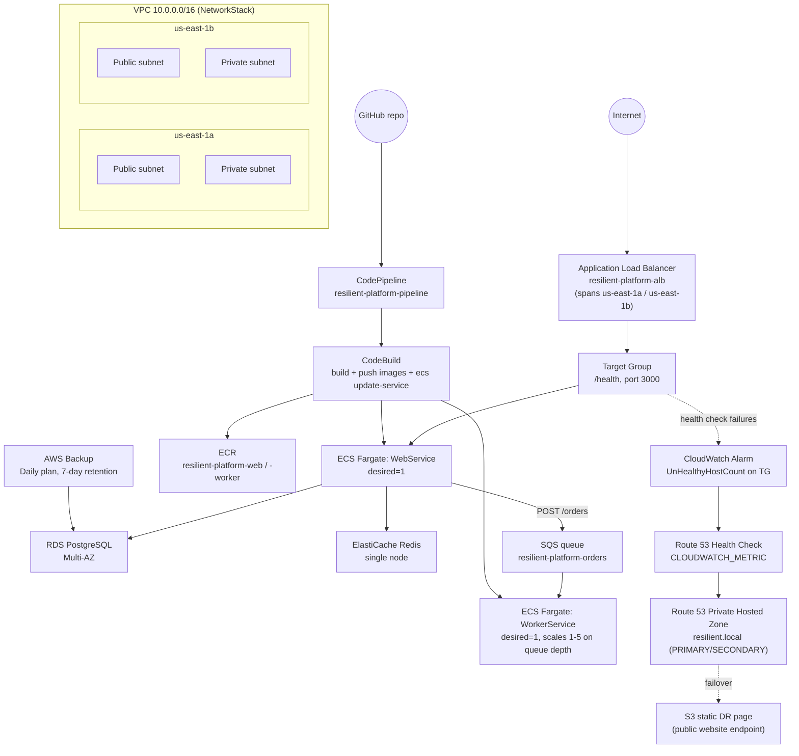
```mermaid
flowchart TB
    subgraph VPC["VPC 10.0.0.0/16 (NetworkStack)"]
        subgraph AZ1["us-east-1a"]
            PUB1["Public subnet"]
            PRIV1["Private subnet"]
        end
        subgraph AZ2["us-east-1b"]
            PUB2["Public subnet"]
            PRIV2["Private subnet"]
        end
    end

    Internet(("Internet")) --> ALB["Application Load Balancer\nresilient-platform-alb\n(spans us-east-1a / us-east-1b)"]
    ALB --> TG["Target Group\n/health, port 3000"]
    TG --> WebSvc["ECS Fargate: WebService\ndesired=1"]
    WebSvc --> RDS["RDS PostgreSQL\nMulti-AZ"]
    WebSvc --> Redis["ElastiCache Redis\nsingle node"]
    WebSvc -- "POST /orders" --> SQS["SQS queue\nresilient-platform-orders"]
    SQS --> WorkerSvc["ECS Fargate: WorkerService\ndesired=1, scales 1-5 on queue depth"]

    GitHub(("GitHub repo")) --> CodePipeline["CodePipeline\nresilient-platform-pipeline"]
    CodePipeline --> CodeBuild["CodeBuild\nbuild + push images + ecs update-service"]
    CodeBuild --> ECR["ECR\nresilient-platform-web / -worker"]
    CodeBuild --> WebSvc
    CodeBuild --> WorkerSvc

    CWAlarm["CloudWatch Alarm\nUnHealthyHostCount on TG"] --> R53HC["Route 53 Health Check\nCLOUDWATCH_METRIC"]
    TG -. "health check failures" .-> CWAlarm
    R53HC --> R53["Route 53 Private Hosted Zone\nresilient.local (PRIMARY/SECONDARY)"]
    R53 -. failover .-> S3DR["S3 static DR page\n(public website endpoint)"]

    Backup["AWS Backup\nDaily plan, 7-day retention"] --> RDS
```

This diagram reflects the actual deployed topology described in the sections below; it is
not an aspirational design. Note the two things it deliberately does **not** show as
resolved: the Route 53 zone is private (see [Disaster Recovery](#disaster-recovery)), and
`WebService`/`WorkerService` both run at `desired=1` in steady state (see
[Limitations](#limitations-and-known-gaps)).

## Components

<table>
<tr><td>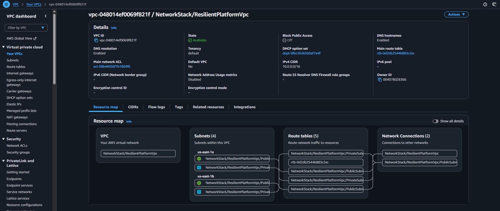<br><sub>VPC resource map — 4 subnets across us-east-1a / us-east-1b</sub></td>
<td>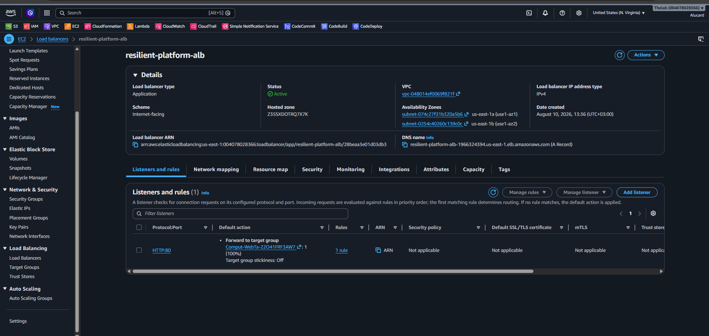<br><sub>ALB active, internet-facing, spanning both AZs</sub></td></tr>
<tr><td>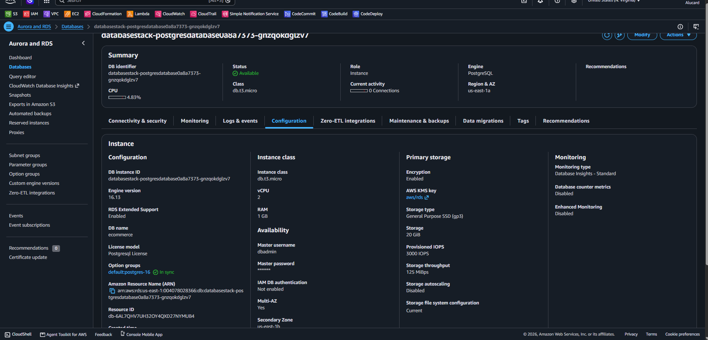<br><sub>RDS instance — Available, Multi-AZ = Yes, secondary zone us-east-1b</sub></td>
<td>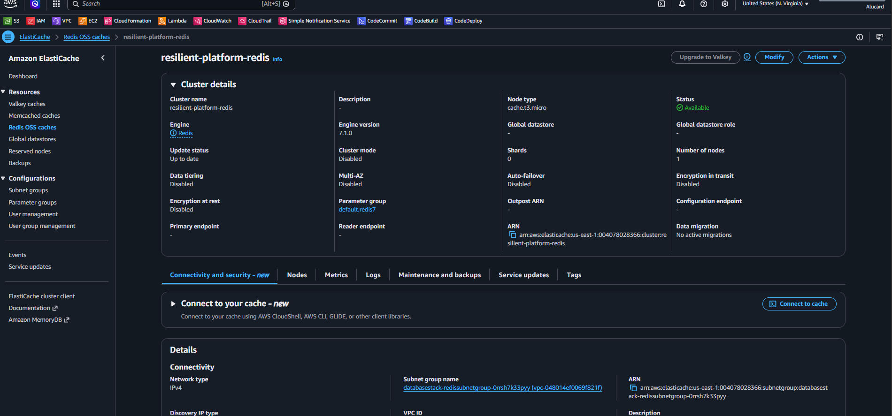<br><sub>ElastiCache Redis — Available, single node, Multi-AZ disabled</sub></td></tr>
</table>

| Component | Status | Evidence |
|---|---|---|
| VPC across 2 AZs (us-east-1a/us-east-1b), 4 subnets (2 public, 2 private) | VERIFIED | `images/vpc1.png` |
| Application Load Balancer, internet-facing, spanning both AZs | VERIFIED | `images/alb.png` |
| ECS Fargate cluster (`resilient-platform-cluster`), 2 services active | VERIFIED | `images/ecstasks.png` |
| RDS PostgreSQL, Multi-AZ enabled, secondary zone us-east-1b, encrypted, available | VERIFIED | `images/rds.png` |
| ElastiCache Redis, available, integrated into the app's `/data` cache-aside path | VERIFIED (see caveat below) | `images/redis.png`, `images/rediscachetest.png` |
| SQS queue (`resilient-platform-orders`) decoupling order submission from processing | VERIFIED | `images/verifyandorderwhileworkerisdown.png` |
| ECR repositories for both web and worker images, both with pushed images | VERIFIED | AWS CLI check (below) |
| AWS Backup: daily plan, 7-day retention, on the RDS instance | VERIFIED (configured **and** validated) | `images/backupjobstart.png`, `images/backupvalidation%20.png` |
| Route 53 failover (CloudWatch-backed health check + PRIMARY/SECONDARY records) | VERIFIED, with a stated architectural limitation | see [Disaster Recovery](#disaster-recovery) |
| CodePipeline/CodeBuild CI/CD, auto-triggered ECS rolling update | VERIFIED | see [CI/CD Pipeline](#cicd-pipeline) |
| Worker auto-scaling on SQS queue depth | VERIFIED | see [Scaling](#scaling) |
| Web service auto-scaling on CPU/ALB request count | MISSING | not implemented — see [Limitations](#limitations-and-known-gaps) |
| CloudWatch dashboard / dedicated monitoring stack | MISSING | `infrastructure/lib/monitoring-stack.ts` exists but is empty and unused |

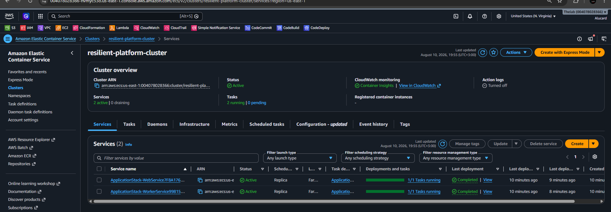<br><sub>ECS cluster — 2 active services, 2 running tasks</sub>

**ElastiCache caveat:** the Redis cluster is a single node with Multi-AZ and auto-failover
both disabled (confirmed in the screenshot above). It is genuinely integrated and used by
the application (see the cache-hit proof below), but the cache layer itself is not highly
available — a Redis node failure would not fail over automatically.

**ECR verification:** the CDK does not create the ECR repositories — `infrastructure/bin/infrastructure.ts`
imports them by name (`ecr.Repository.fromRepositoryName`). Checked directly against AWS
during this project:
```
aws ecr describe-images --repository-name resilient-platform-web
aws ecr describe-images --repository-name resilient-platform-worker
```
Both repositories exist and both contain multiple pushed images, including a `latest` tag
on the worker repository pushed seconds after the CodeBuild stage completed — confirming
the pipeline pushes both images, not just the web image.

**Redis integration proof:** two consecutive calls to `GET /data` — the first returns
`"source":"postgres"` (cache miss, read from RDS), the second returns `"source":"redis"`
with the same timestamp value (cache hit) — demonstrating the cache-aside pattern actually
functions, not just that Redis is reachable.

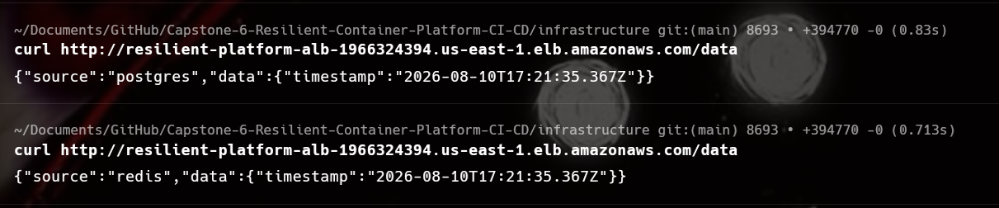<br><sub>rediscachetest.png — postgres source, then redis source, same data</sub>

**SQS decoupling proof:** `aws ecs list-tasks` for the worker service returns zero tasks
(`"taskArns": []`), and in the same terminal a `POST /orders` request against the ALB still
returns `{"message":"Order queued"}` — the web tier accepts and queues orders successfully
with the worker completely stopped, which is the actual point of the queue.

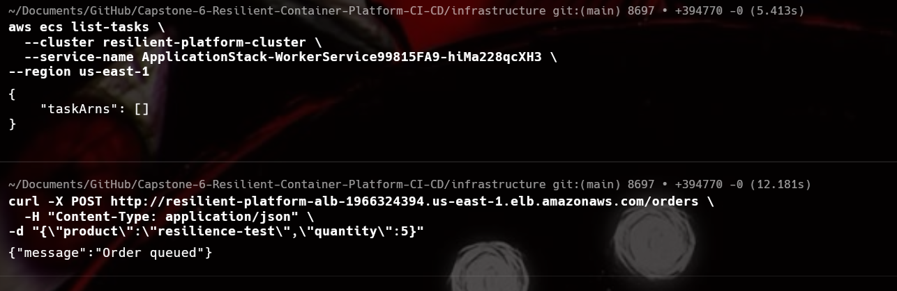<br><sub>verifyandorderwhileworkerisdown.png — worker at 0 tasks, order still queued successfully</sub>

## CI/CD Pipeline

Pipeline: `resilient-platform-pipeline` — GitHub source (via CodeStar Connections) →
CodeBuild (build both images, push to ECR, `ecs update-service --force-new-deployment` for
both services). No separate CodeDeploy/appspec stage — the ECS rolling update is triggered
directly from `buildspec.yml`, not a blue/green CodeDeploy action.

**Proof of an automatic, successful, end-to-end run:**

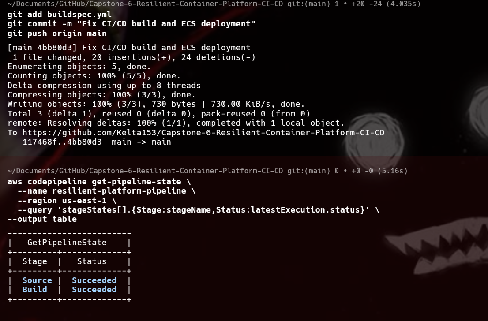<br><sub>pushandpipeline.png — a git push to main, immediately followed by aws codepipeline get-pipeline-state showing Source: Succeeded, Build: Succeeded</sub>

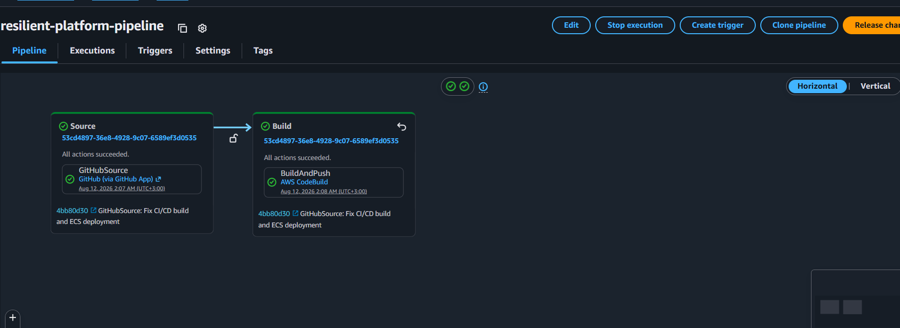<br><sub>pipeline.png — the CodePipeline console for the same execution, both stages green</sub>

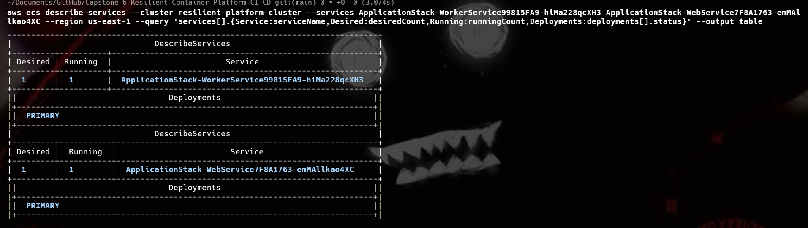<br><sub>ecsafterdeployment.png — both ECS services at desired=1 / running=1, deployment status PRIMARY, immediately after the rolling update</sub>

This is the CI/CD Proof required by the README rubric — `images/pipeline.png` is the
primary screenshot, `images/pushandpipeline.png` is supporting evidence that it was
triggered automatically by the push rather than manually started.

**Known gap:** the rubric asks for pipeline configuration files to live under `pipeline/`.
That directory currently exists but is empty; `buildspec.yml` is at the repository root
instead. Functionally the pipeline works end-to-end — this is a file-location issue, not a
missing capability.

## Scaling

Only the **worker** service has auto-scaling configured — target/step scaling on SQS queue
depth (`infrastructure/lib/application-stack.ts`): metric = visible messages ÷ desired
worker count, scaling steps at 5, 10, and 20 messages-per-worker, `minCapacity=1`,
`maxCapacity=5`.

**Test performed:** a large burst (~1,000+ messages) was sent directly to
`resilient-platform-orders` while a single worker task was running.

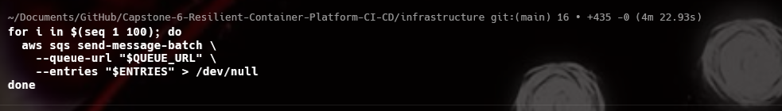<br><sub>workersscaling1000req1.png — sending the load burst</sub>
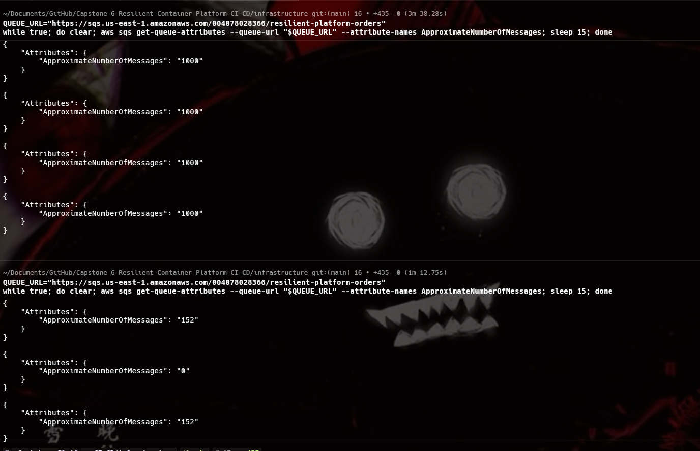<br><sub>workerscaling1000req2.png — load burst continuing</sub>

Because a single worker task drains roughly 25–30 messages/second, the queue emptied faster
than manual polling could observe it — checking queue depth shortly after looked like
nothing had happened. It had: `aws ecs describe-services` confirmed the worker scaled
**1 → 3** tasks, and the CloudWatch `ECS/ContainerInsights` `DesiredTaskCount`/`RunningTaskCount`
metrics for the service confirm the same step, retroactively, from the historical data:

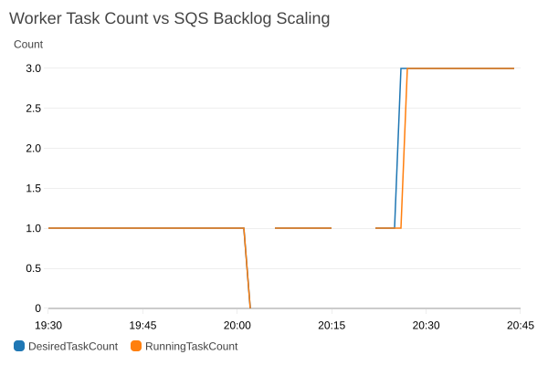<br><sub>worker-scaling-proof.png — chart rendered via aws cloudwatch get-metric-widget-image, DesiredTaskCount and RunningTaskCount both step 1 → 3</sub>

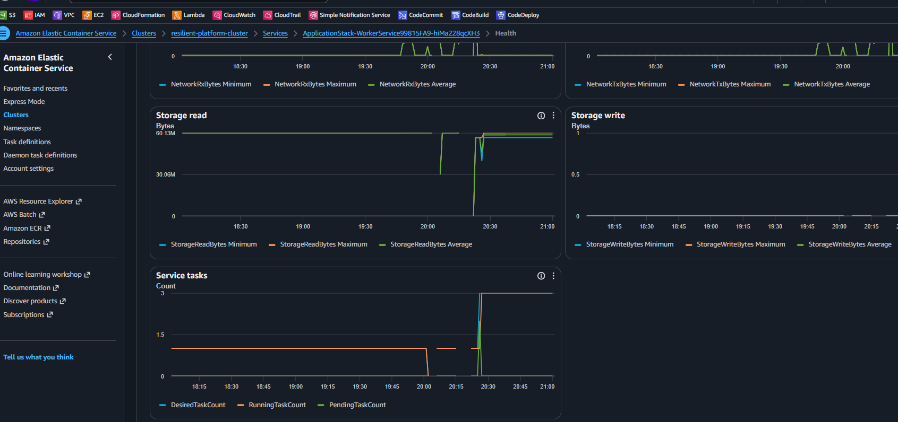<br><sub>consoleworketservicecont.png — the same 1 → 3 step, independently, from the ECS console's own Service tasks graph</sub>

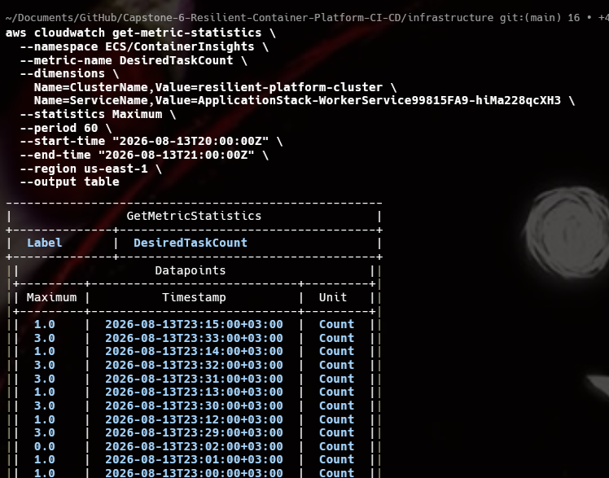<br><sub>workercount1.png — raw get-metric-statistics datapoints, DesiredTaskCount alternating 1.0 / 3.0</sub>
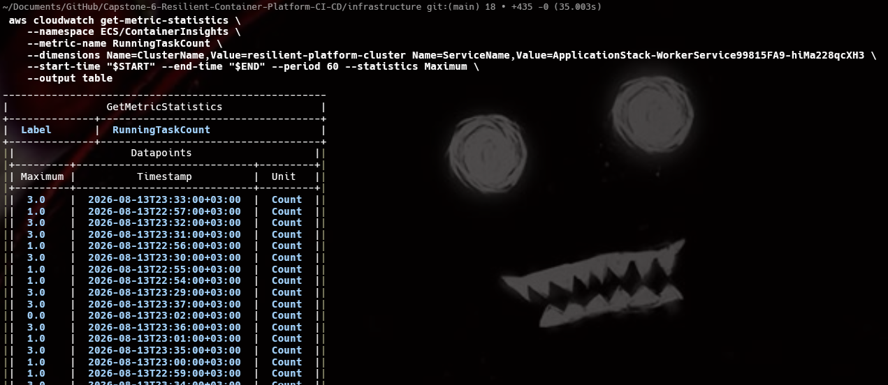<br><sub>workercount2.png — raw get-metric-statistics datapoints, RunningTaskCount alternating 1.0 / 3.0</sub>

Use `images/worker-scaling-proof.png` or `images/consoleworketservicecont.png` as the
Scaling Proof screenshot for the README rubric requirement.

**Important, stated plainly:** there is no scale-in policy. The worker will scale out under
load but will not automatically scale back down. After capturing this evidence the worker
was manually returned to `desired-count 1` to stop paying for idle tasks. This is a real
gap, not an oversight to gloss over — see [Limitations](#limitations-and-known-gaps).

The web service has no scaling policy at all (confirmed via
`aws application-autoscaling describe-scaling-policies` — zero policies registered against
`WebService`). CPU/ALB-based scaling for the frontend, as called for in the project's Step
2, was not implemented.

## Disaster Recovery

### AWS Backup

Daily backup plan (`resilient-platform-daily-backup`), 02:00 UTC, 7-day retention,
targeting the RDS instance (`infrastructure/lib/backup-stack.ts`).

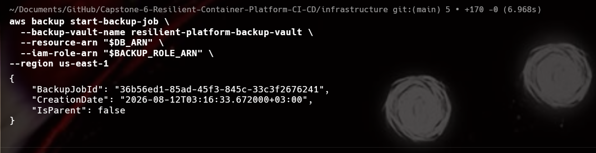<br><sub>backupjobstart.png — aws backup start-backup-job producing a BackupJobId</sub>

<br><sub>backupvalidation.png — list-recovery-points-by-backup-vault and describe-backup-job confirming State: COMPLETED, PercentDone: 100.0 against the RDS ARN</sub>

Additionally verified during this project via `aws backup list-backup-jobs --by-state COMPLETED`:
three separate completed jobs on three different calendar days, consistent with the daily
schedule actually firing on its own — this is **validated**, not just configured.

### Route 53 health check and failover — what was actually tested

Route 53 health check `7d53d8b7-f6ff-4e1e-a01d-6266090f86cf` is type `CLOUDWATCH_METRIC`,
wired to CloudWatch alarm `Route53Stack-ALBUnhealthyHostAlarmDD9DBFBB-ysq85EtETo47`, which
watches `AWS/ApplicationELB UnHealthyHostCount` (Maximum, period 60s, 2 evaluation periods,
threshold ≥ 1) on the web target group. Route 53 does not probe the ALB directly — it
reflects this alarm's state.

**First attempt (did not work, and the reason matters):** setting the web service's
`desired-count` to `0` stops and deregisters the ECS task. A deregistered target is not
counted by `UnHealthyHostCount`, so the alarm never breached. This told us the alarm
specifically requires a *registered* target that fails its own ALB health check — not a
target that disappears.

**Corrected test — the actual failure simulation, in order:**

<table>
<tr><td>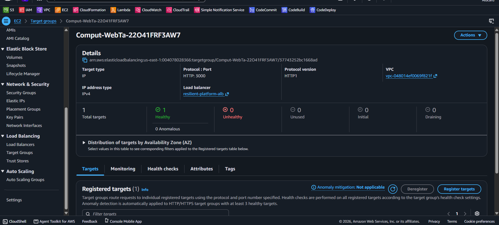<br><sub>1. Baseline — target group has 1 target, healthy</sub></td>
<td>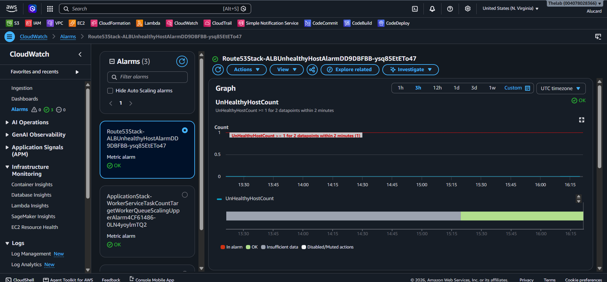<br><sub>2. Baseline — alarm OK, flat metric</sub></td></tr>
<tr><td>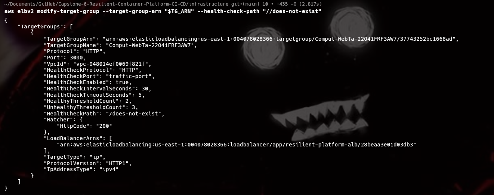<br><sub>3. Health check path changed to force a failure; the ECS task itself is untouched</sub></td>
<td>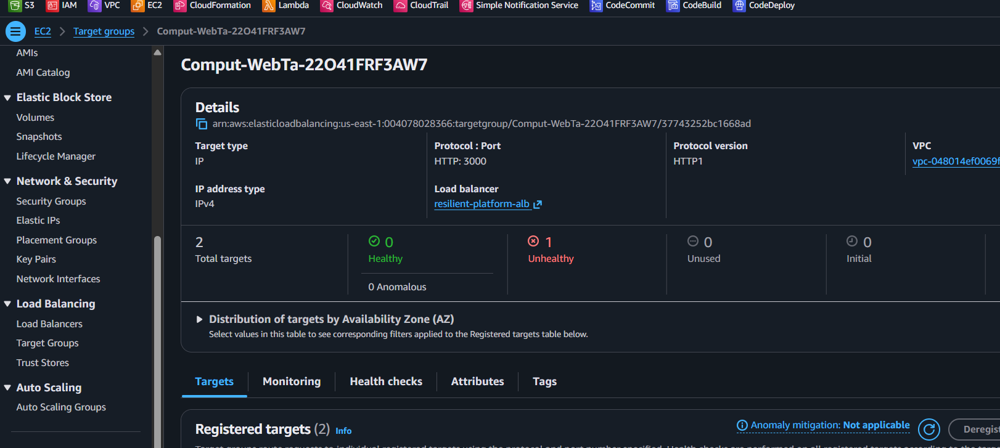<br><sub>4. ALB reports the target Unhealthy — Target.ResponseCodeMismatch, [404]</sub></td></tr>
<tr><td>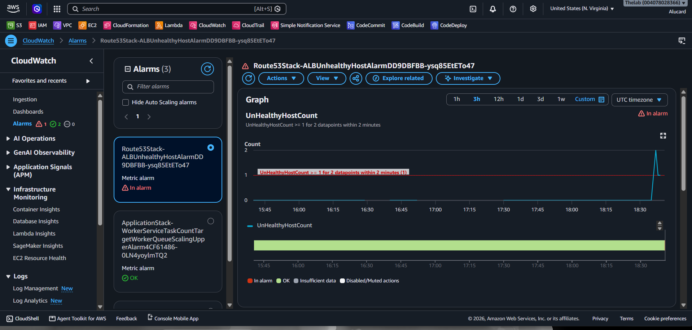<br><sub>5. CloudWatch alarm transitions to In alarm, threshold crossed</sub></td>
<td>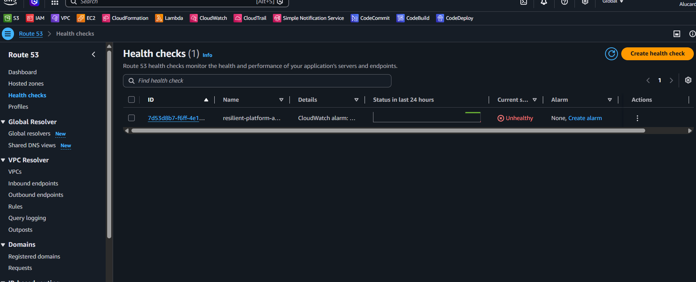<br><sub>6. Route 53 health check's own console status flips to Unhealthy</sub></td></tr>
</table>

A second target also appears mid-test in image 4: ECS's own service scheduler
independently attempts to replace an ALB-unhealthy target, which is a separate mechanism
from the CloudWatch alarm being described here.

The health check path was then restored to `/health`. The target returned to healthy, the
alarm returned to `OK`, and the application's own `/health` endpoint was confirmed
responding `{"status":"healthy"}` again. This recovery was confirmed via CLI output during
the test; no separate "after" screenshot was captured distinct from the baseline images
above, which is noted here rather than implied by an image that doesn't exist.

**This chain — steps 1 through 6 above — is what was validated: a registered target
failing its ALB health check propagates through CloudWatch into a Route 53 health check
state change.** That is the DR Runbook & Failover Proof for this project.

### What was explicitly not demonstrated, and why

`resilient.local` is a **private** Route 53 hosted zone. It cannot be resolved from the
public internet, and `aws route53 test-dns-answer` does not support private zones
(confirmed: `InvalidInput: Cannot send DNS query to a Private Hosted Zone`). There is also
no EC2/bastion host inside the VPC to run a real internal `dig` from.

**This project did not demonstrate a public or browser-based DNS failover.** What was
demonstrated is the full mechanical chain up to and including the Route 53 health check
itself changing state (steps 1–6 above), which is the part of the system that decides
whether to fail over. The DNS resolution step past that point was not exercised.

The S3 static DR page exists and renders correctly:

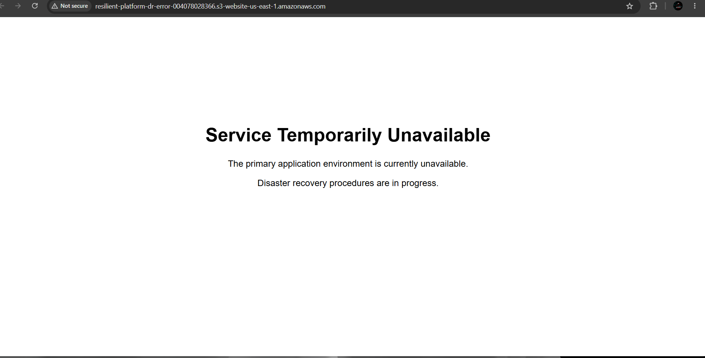<br><sub>404page.png — resilient-platform-dr-error-004078028366.s3-website-us-east-1.amazonaws.com rendering the "Service Temporarily Unavailable" page from route53-stack.ts</sub>

This screenshot proves the DR page content exists and is publicly reachable at its own S3
website endpoint. It was reached directly, **not** through Route 53 DNS failover — there is
no evidence in this project of the private zone actually resolving to this page, and that
claim is not made.

## Observability

- Two CloudWatch alarms exist and are functioning: the Route 53/ALB health alarm described
  above, and the worker's SQS-depth scaling alarm.
- ECS Container Insights is enabled on the cluster (`containerInsightsV2: ecs.ContainerInsights.ENABLED`
  in `compute-stack.ts`), which is what makes the `DesiredTaskCount`/`RunningTaskCount`
  scaling metrics available.
- There is no CloudWatch dashboard and no dedicated monitoring stack —
  `infrastructure/lib/monitoring-stack.ts` is present in the repository but is an empty file
  and is not imported anywhere in `bin/infrastructure.ts`. All observability in this project
  is via ad hoc console/CLI metric queries, not a built dashboard. This is marked MISSING,
  not implied to exist because the file exists.

## Limitations and Known Gaps

Stated directly, without downplaying:

- **No web-service auto-scaling.** Only the worker scales. The project's own Step 2 calls
  for the frontend to scale on CPU/ALB requests; that was not built.
- **No scale-in policy on the worker.** It scales out under load and stays there until
  manually scaled back down.
- **Single NAT gateway.** Both private subnets share one NAT gateway in one AZ — a soft
  single point of failure for outbound connectivity, even though the subnets themselves
  span two AZs.
- **ElastiCache is a single node**, Multi-AZ and auto-failover both disabled.
- **`WebService` and `WorkerService` both run at `desired=1`** in steady state. The
  infrastructure (subnets, ALB) spans two AZs, but with one task each, neither service is
  actually running redundantly across AZs at rest — a single task failure is a real outage
  until ECS replaces it, not an instant failover to a standby task.
- **Route 53 failover is privately-scoped**, as detailed above — no public DNS failover was
  or can be demonstrated with the current zone configuration.
- **`pipeline/` directory is empty**; `buildspec.yml` lives at the repository root instead.
  No `appspec.yml` exists, since deployment goes through `ecs update-service` in
  `buildspec.yml` directly rather than CodeDeploy blue/green.
- **No CloudWatch dashboard** — `monitoring-stack.ts` is unused and empty.

## Evidence Index

<table>
<tr><th>Preview</th><th>File</th><th>What it shows</th></tr>
<tr><td></td><td><code>vpc1.png</code></td><td>VPC resource map: 4 subnets across us-east-1a/us-east-1b</td></tr>
<tr><td>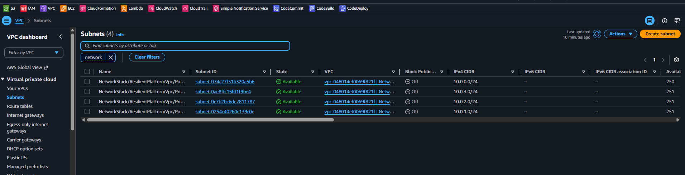</td><td><code>vpcsubnet.png</code></td><td>Subnet detail</td></tr>
<tr><td></td><td><code>alb.png</code></td><td>ALB active, internet-facing, spanning both AZs</td></tr>
<tr><td>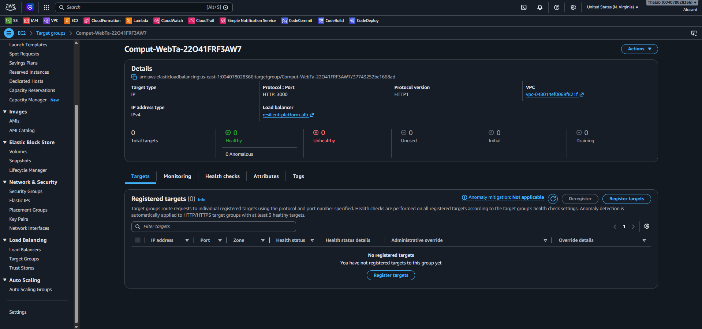</td><td><code>targetgroup.png</code></td><td>Target group configuration</td></tr>
<tr><td></td><td><code>rds.png</code></td><td>RDS instance: Available, Multi-AZ = Yes, secondary zone us-east-1b</td></tr>
<tr><td></td><td><code>redis.png</code>, <code>redis2.png</code></td><td>ElastiCache Redis cluster: Available, single node, Multi-AZ disabled</td></tr>
<tr><td></td><td><code>rediscachetest.png</code></td><td>Cache-aside proof: postgres source then redis source, same data</td></tr>
<tr><td></td><td><code>ecstasks.png</code></td><td>ECS cluster: 2 active services, 2 running tasks</td></tr>
<tr><td>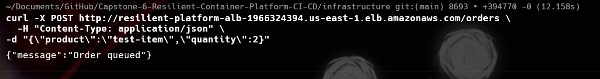</td><td><code>orderflowtest.png</code></td><td><code>POST /orders</code> → <code>{"message":"Order queued"}</code></td></tr>
<tr><td>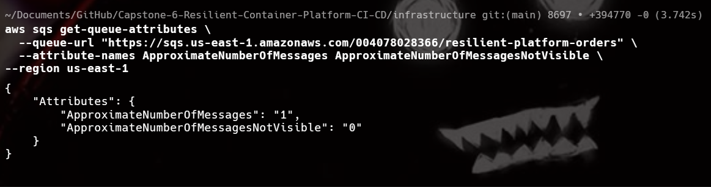</td><td><code>SQSmessagesitting.png</code></td><td>Message visible in the SQS queue</td></tr>
<tr><td>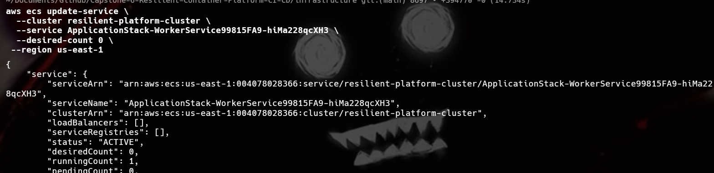</td><td><code>scaleECSto0.png</code></td><td>Worker manually scaled to 0 (functional SQS-buffering test, separate from the CloudWatch scaling test)</td></tr>
<tr><td></td><td><code>verifyandorderwhileworkerisdown.png</code></td><td>Order accepted via SQS while worker has 0 running tasks</td></tr>
<tr><td>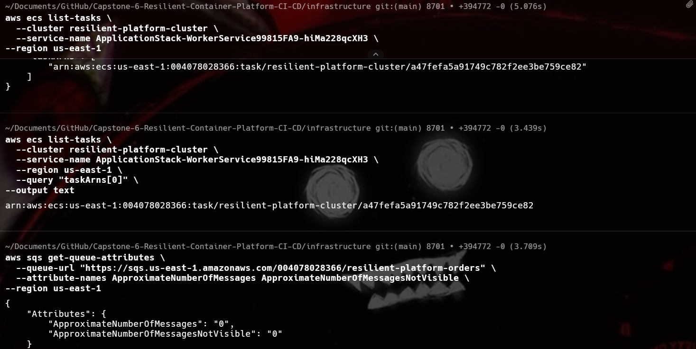</td><td><code>sqsafternewworker.png</code></td><td>SQS depth after the worker resumes</td></tr>
<tr><td>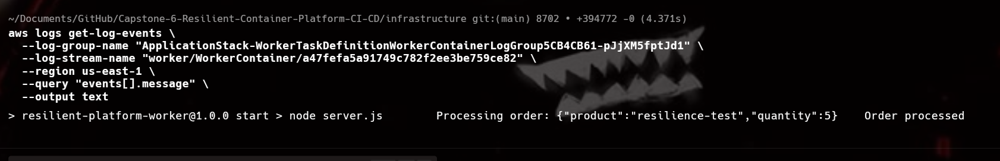</td><td><code>cloudwatchlogafternewworkforsqq.png</code></td><td>Worker logs draining the backlog after resuming</td></tr>
<tr><td>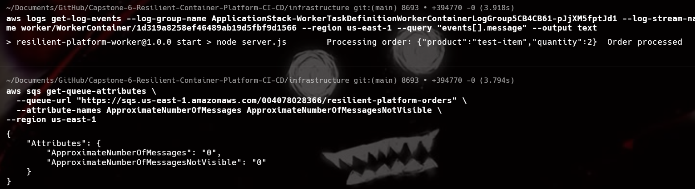</td><td><code>cloudwatchlogsandSQSemptyprocessing.png</code></td><td>Worker logs processing, queue emptying</td></tr>
<tr><td>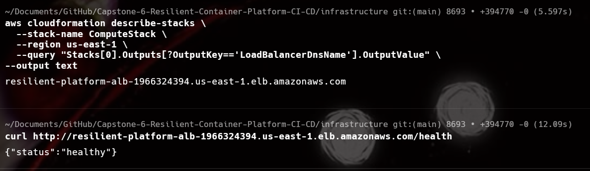</td><td><code>albhealthquery.png</code></td><td>ALB health check configuration query</td></tr>
<tr><td></td><td><code>pushandpipeline.png</code></td><td>Git push followed by <code>get-pipeline-state</code> showing both stages Succeeded</td></tr>
<tr><td></td><td><code>pipeline.png</code></td><td>CodePipeline console, both stages green</td></tr>
<tr><td></td><td><code>ecsafterdeployment.png</code></td><td>Both ECS services stable at desired=running=1 after the deploy</td></tr>
<tr><td></td><td><code>backupjobstart.png</code></td><td><code>start-backup-job</code> producing a job ID</td></tr>
<tr><td></td><td><code>backupvalidation .png</code></td><td>Backup job COMPLETED, 100%, against the RDS ARN</td></tr>
<tr><td></td><td><code>cloudwatchalarmroute53beforeunhealth.png</code></td><td>Alarm baseline: OK</td></tr>
<tr><td></td><td><code>targetgrouphealth.png</code></td><td>Target group baseline: 1 target, healthy</td></tr>
<tr><td></td><td><code>modifytgtounhealthypath.png</code></td><td>Health check path changed to force a failure</td></tr>
<tr><td></td><td><code>tgunhealthy.png</code></td><td>Target group: target(s) unhealthy, 404</td></tr>
<tr><td></td><td><code>cloudwatchroute53inalarm.png</code></td><td>Alarm: In alarm, threshold crossed</td></tr>
<tr><td></td><td><code>route53unhealthy.png</code></td><td>Route 53 health check console status: Unhealthy</td></tr>
<tr><td></td><td><code>404page.png</code></td><td>S3 DR page rendered at its public website endpoint</td></tr>
<tr><td></td><td><code>workersscaling1000req1.png</code>, <code>workerscaling1000req2.png</code></td><td>SQS load burst being sent</td></tr>
<tr><td></td><td><code>worker-scaling-proof.png</code></td><td>CLI-rendered chart: worker task count 1 → 3</td></tr>
<tr><td></td><td><code>workercount1.png</code>, <code>workercount2.png</code></td><td>Raw CloudWatch datapoints backing the chart</td></tr>
<tr><td></td><td><code>consoleworketservicecont.png</code></td><td>ECS console's own graph of the same 1 → 3 step</td></tr>
</table>

## Rubric Self-Assessment

Labels used: **VERIFIED**, **CONFIGURED BUT NOT TESTED**, **PARTIALLY VERIFIED**,
**NOT CONFIRMED**, **MISSING**.

### A. Highly Available & Resilient Infrastructure — 40 pts

| Requirement | Status | Evidence |
|---|---|---|
| Multi-AZ ECS Fargate with ALB across ≥2 AZs | PARTIALLY VERIFIED | Subnets/ALB span 2 AZs (`vpc1.png`, `alb.png`); services run at desired=1, so no live cross-AZ task redundancy at rest |
| RDS Multi-AZ | VERIFIED | `rds.png` |
| ElastiCache integrated for performance | VERIFIED (cache itself not HA) | `redis.png`, `rediscachetest.png` |
| SQS decoupling | VERIFIED | `verifyandorderwhileworkerisdown.png` |
| "True HA/fault tolerance" | PARTIALLY VERIFIED | Data tier is genuinely Multi-AZ; compute tier is not redundant at desired=1; single NAT gateway |

### B. Scalability, Automation & CI/CD Pipeline — 35 pts

| Requirement | Status | Evidence |
|---|---|---|
| Automated CI/CD, GitHub → build → deploy | VERIFIED | `pushandpipeline.png`, `pipeline.png`, `ecsafterdeployment.png` |
| Docker images for web and worker pushed to ECR | VERIFIED | AWS CLI check, both repos, worker `latest` tag timed to the build |
| ECS services updated automatically | VERIFIED | `ecsafterdeployment.png`, `buildspec.yml`'s `ecs update-service --force-new-deployment` |
| Target tracking / step scaling configured and working | PARTIALLY VERIFIED | Worker SQS-based scaling VERIFIED (`worker-scaling-proof.png`); web CPU/ALB-based scaling MISSING |

### C. Observability, Disaster Recovery & Documentation — 25 pts

| Requirement | Status | Evidence |
|---|---|---|
| CloudWatch metrics demonstrate scaling | VERIFIED | `worker-scaling-proof.png`, `consoleworketservicecont.png` |
| AWS Backup automated snapshots | VERIFIED (configured and validated) | `backupjobstart.png`, `backupvalidation .png`, CLI history of 3 completed daily jobs |
| Route 53 failover with health checks | PARTIALLY VERIFIED | Full alarm→health-check chain VERIFIED; public/DNS-level failover NOT CONFIRMED (architecturally private) |
| DR scenario documented and validated | VERIFIED, with stated scope | This document + evidence above; scope limited to the alarm/health-check chain, stated explicitly |
| README contains diagram, CI/CD proof, scaling proof, failover evidence | VERIFIED as of this document | This README |
